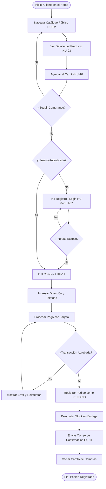
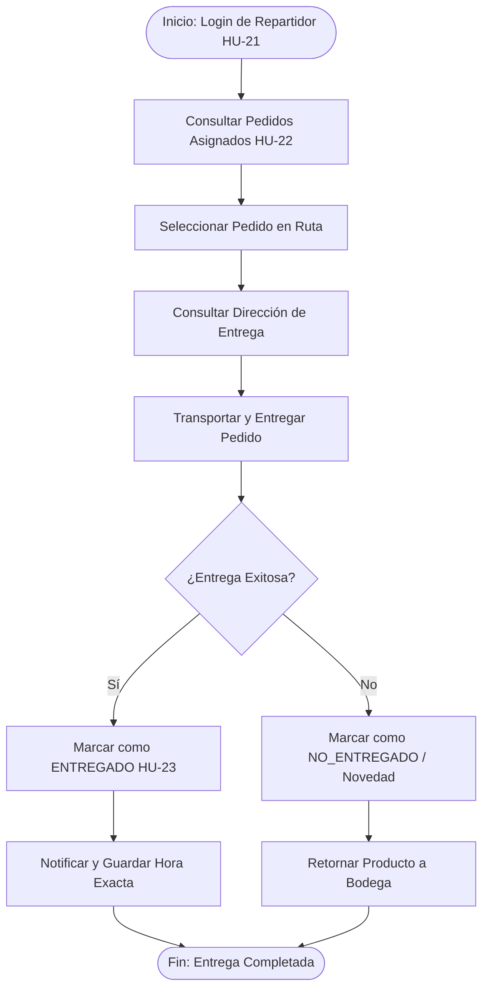
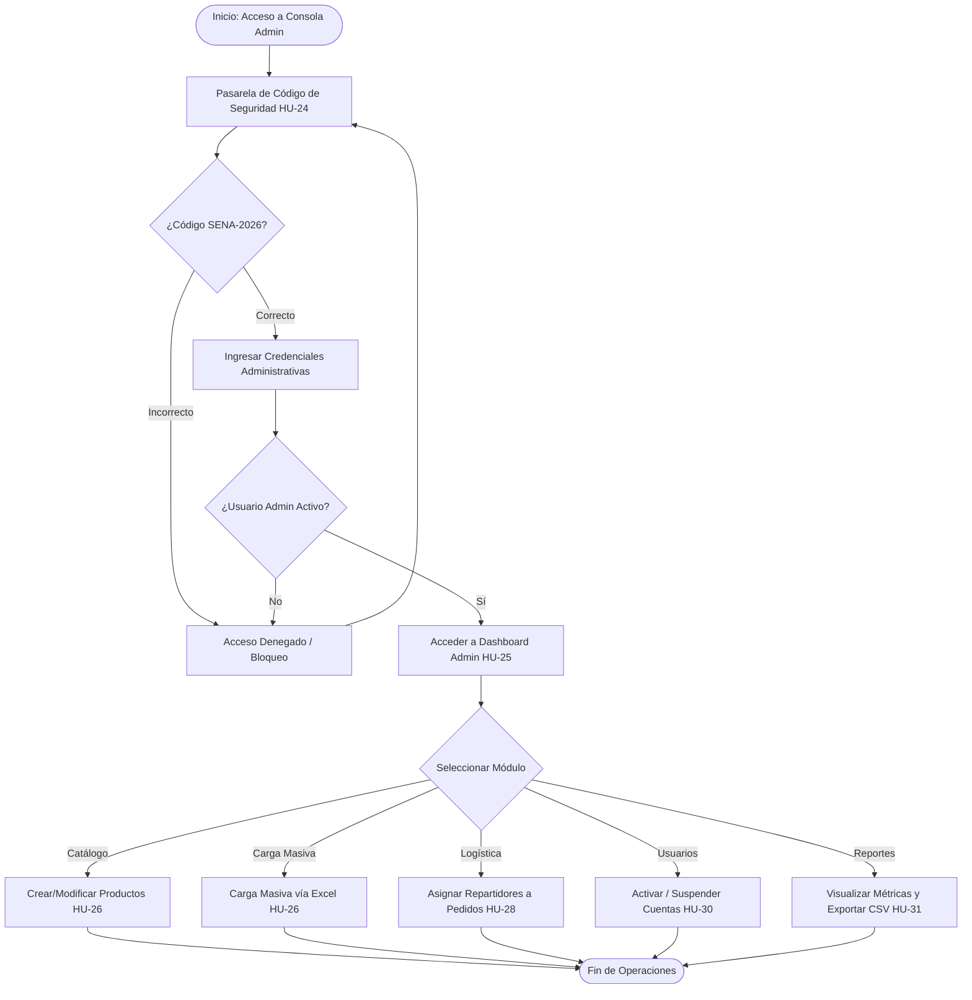
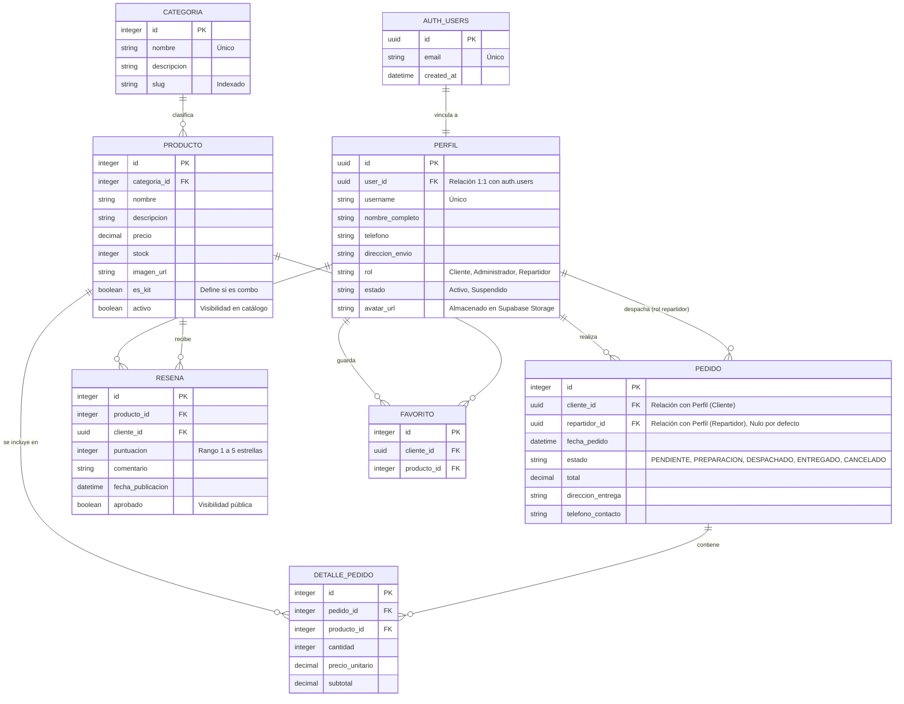

# DIAGRAMAS DE ARQUITECTURA Y DISEÑO — MIKITECH E-COMMERCE

Este documento contiene los diagramas formales de arquitectura de procesos y del modelo lógico de datos (Entidad-Relación) de la plataforma MIKITECH E-Commerce. Estos diagramas sirven de base para el equipo de desarrollo y aseguramiento de calidad (QA).

> [!NOTE]
> Todos los diagramas de este archivo están desarrollados bajo la sintaxis **Mermaid.js**. Si visualizas este documento en un IDE compatible o plataforma como GitHub, se renderizarán de forma gráfica e interactiva.

> [!TIP]
> **Para usar en Mermaid Live Editor (https://mermaid.live):**
> Copia únicamente el contenido de texto que está entre las marcas de `<!-- INICIO ... -->` y `<!-- FIN ... -->` (excluyendo las comillas triples ```).

---

## 1. DIAGRAMAS DE PROCESOS (Flujos de Negocio)

A continuación se detallan los tres flujos operacionales principales del e-commerce correspondientes a los diferentes actores del sistema.

### A. Ciclo de Compra y Checkout (Cliente)
Este diagrama de flujo describe el camino de un usuario desde que ingresa como visitante al catálogo hasta que completa una transacción y se realiza el despacho de su pedido.

<!-- INICIO DIAGRAMA COMPRA CLIENTE (Copiar desde aquí) -->

<!-- FIN DIAGRAMA COMPRA CLIENTE (Hasta aquí) -->

---

### B. Ciclo de Despacho y Entrega (Repartidor)
Describe el proceso que realiza un repartidor (domiciliario) registrado para entregar un pedido en camino.

<!-- INICIO DIAGRAMA ENTREGA REPARTIDOR (Copiar desde aquí) -->

<!-- FIN DIAGRAMA ENTREGA REPARTIDOR (Hasta aquí) -->

---

### C. Ciclo de Gestión y Auditoría (Administrador)
Describe la pasarela de seguridad y las operaciones del administrador en el Panel de Control.

<!-- INICIO DIAGRAMA AUDITORÍA ADMIN (Copiar desde aquí) -->

<!-- FIN DIAGRAMA AUDITORÍA ADMIN (Hasta aquí) -->

---

## 2. DIAGRAMA DE ENTIDAD-RELACIÓN (ERD)

Este diagrama representa el modelo lógico de la base de datos de **MIKITECH** implementada en **Supabase (PostgreSQL)** e integrada con los modelos de **Django**. Mapea las tablas de negocio, seguridad y estadísticas con sus atributos y llaves foráneas.

<!-- INICIO DIAGRAMA ENTIDAD-RELACIÓN ERD (Copiar desde aquí) -->

<!-- FIN DIAGRAMA ENTIDAD-RELACIÓN ERD (Hasta aquí) -->
