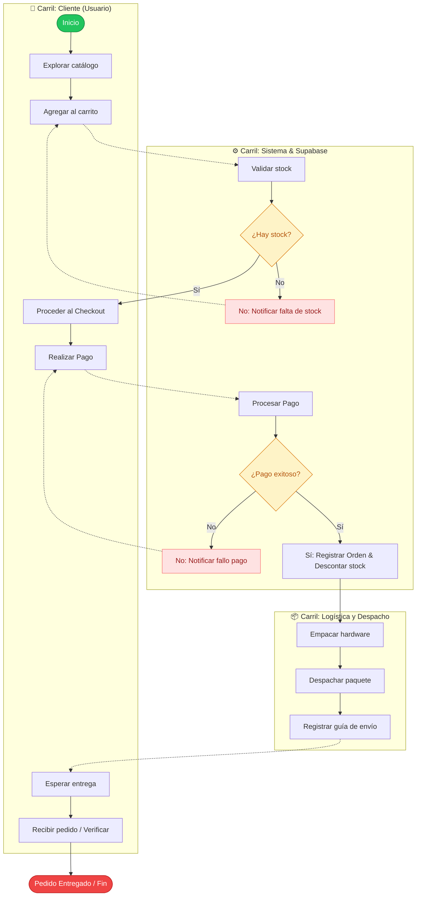
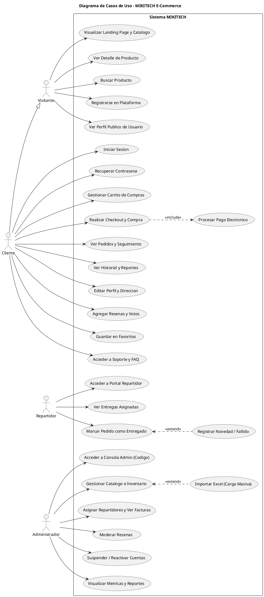
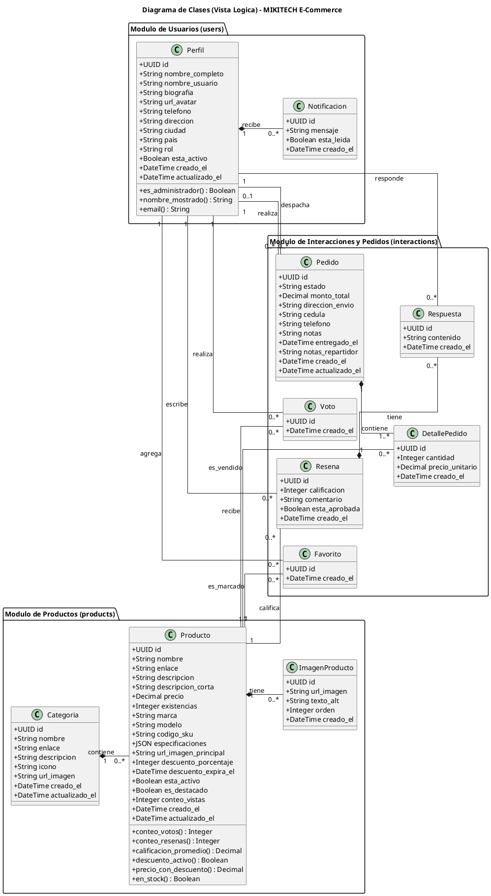
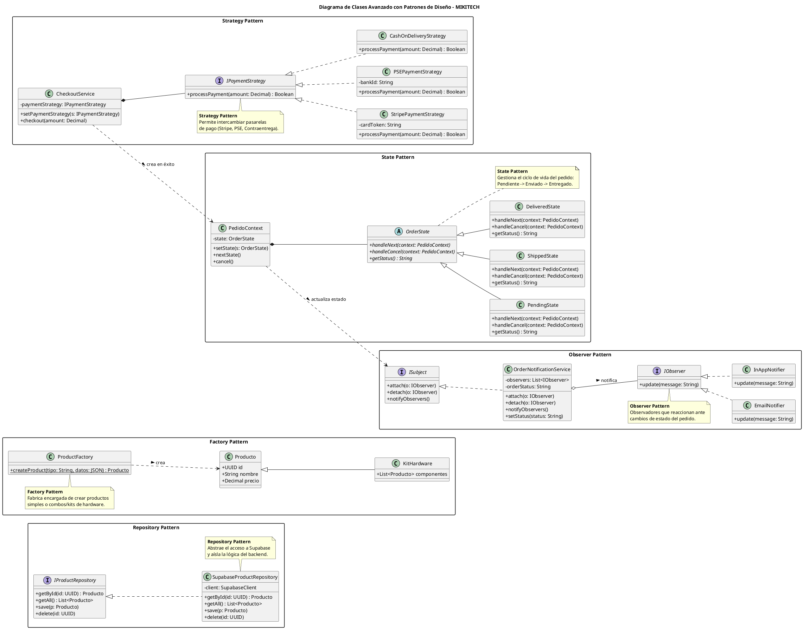
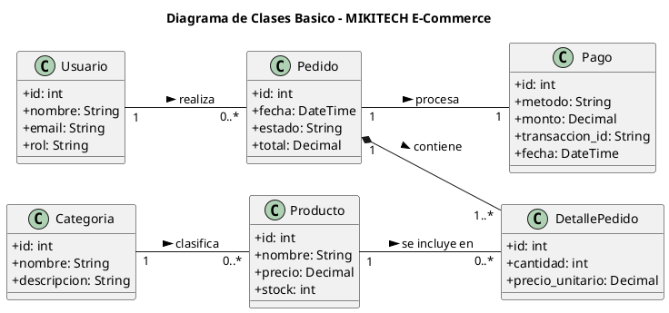
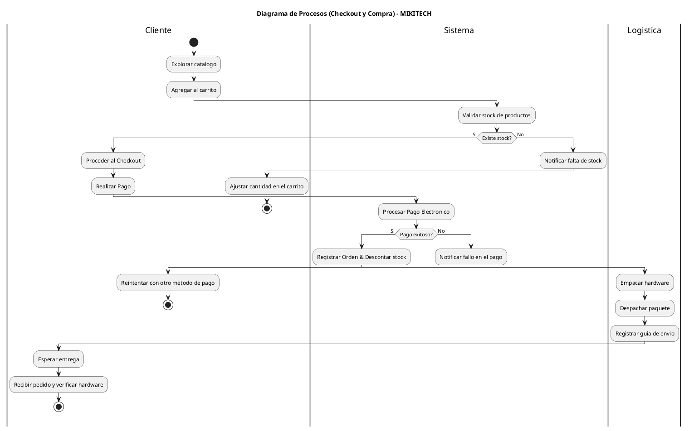

# 📋 Diagrama de Procesos - E-commerce MIKITECH

Este documento detalla y explica el flujo de procesos del **Ciclo de Compra y Checkout de la aplicación MIKITECH**, el cual organiza las responsabilidades y transiciones de estados entre el Cliente, la Plataforma Backend con Supabase, y el equipo de Logística y Despacho.

El flujo completo interactivo y responsivo se encuentra disponible en formato HTML/CSS en el archivo [diagrama_procesos.html](file:///c:/Users/turca/Desktop/MIKITECH-APP/diagrama_procesos.html).

---

## 👥 Roles y Actores del Proceso

El flujo de compra se distribuye en **3 carriles (swimlanes)** que delimitan las responsabilidades operativas y lógicas:

1. **👤 Cliente (Usuario):**
   * Explora los productos de hardware en la tienda.
   * Agrega artículos a su carrito y procede a completar sus datos en el checkout.
   * Realiza el pago electrónico y espera el arribo de su paquete para realizar la verificación final.
2. **⚙️ Sistema y Supabase (Backend Django):**
   * Valida automáticamente el stock del inventario en la base de datos de Supabase.
   * Procesa las llamadas HTTP a la pasarela de pagos (ej: Stripe).
   * Genera el registro de la Orden de Compra, descuenta stock y despacha notificaciones por correo de forma automatizada.
3. **📦 Logística y Despacho (Administrador de Bodega):**
   * Recibe la alerta de la orden aprobada y pagada en el panel de control.
   * Prepara físicamente el hardware (picking & packing) y genera la etiqueta.
   * Despacha el paquete con la transportadora y registra el número de guía de seguimiento.

---

## 🔄 Descripción Detallada del Flujo de Compra

El proceso fluye de la siguiente manera:

### 1. Selección y Validación de Inventario
* El **Cliente** explora el catálogo de hardware y agrega componentes a su carrito.
* La acción de agregar al carrito activa en el **Sistema** la tarea de **Validar stock de productos**.
* **Bifurcación / Gateway de Stock**:
  * **NO (Sin Stock)**: Se notifica la falta de inventario y se regresa al Cliente al flujo de ajuste de su carrito.
  * **SÍ (Con Stock)**: Permite al Cliente avanzar y ejecutar la acción **Proceder al Checkout**.

### 2. Procesamiento de Checkout y Pago
* El **Cliente** completa sus datos de envío y hace clic en **Confirmar y Realizar Pago**.
* El **Sistema** procesa la transacción de pago.
* **Bifurcación / Gateway de Pago**:
  * **NO (Transacción Fallida)**: Se notifica el fallo en la transacción y se regresa al Cliente a la pantalla de pago para reintentar con otro medio.
  * **SÍ (Aprobado)**: Se genera la Orden de Compra definitiva en la base de datos, se descuenta el stock del inventario permanentemente y se envía un correo de confirmación.

### 3. Alistamiento y Despacho Físico (Logística)
* El equipo de **Logística** recibe la orden de compra aprobada en bodega.
* Se procede a **Empacar el hardware** y **Despachar el paquete** mediante la transportadora.
* Una vez entregado el paquete a la transportadora, el despachador ejecuta la tarea **Registrar número de guía**.

### 4. Entrega y Cierre
* El registro de la guía notifica al **Cliente**, quien pasa al estado **Esperar entrega**.
* Al recibir el paquete físico de la transportadora, el **Cliente** realiza la tarea de **Recibir pedido y verificar hardware**.
* El proceso finaliza con éxito (**Pedido Entregado**).

---

## 📊 Representación Gráfica (Mermaid BPMN Diagram)

Diagrama de carriles horizontales que representa la lógica del ciclo de compra en MIKITECH:

---

## 🔗 Enlace al Documento de Visualización Interactiva
Para interactuar visualmente con las swimlanes a color, las cajas adaptativas y las flechas de flujo calculadas por SVG, abre el archivo local en tu navegador:
👉 **[diagrama_procesos.html](file:///c:/Users/turca/Desktop/MIKITECH-APP/diagrama_procesos.html)**

---

## 🎭 Diagrama de Casos de Uso (PlantUML)

A continuación se presenta el código fuente en formato PlantUML para el **Diagrama de Casos de Uso** del sistema MIKITECH, que modela las interacciones de los cuatro roles principales: **Visitante**, **Cliente**, **Repartidor** y **Administrador**.

---

## 📐 Diagrama de Clases (PlantUML)

Este diagrama representa la estructura de clases del backend de **MIKITECH** basado en Django Models. Define las propiedades, tipos de datos, métodos de negocio y las relaciones estructurales entre los modelos principales de **Usuarios**, **Productos** e **Interacciones/Ventas**.

---

## 🏆 Diagrama de Clases Avanzado con Patrones de Diseño (PlantUML)

Este diagrama representa la propuesta de diseño de arquitectura de software para la evolución de **MIKITECH**, aplicando patrones de diseño del GOF (Gang of Four) para solucionar problemas de escalabilidad, acoplamiento y mantenimiento del sistema.

### Patrones Aplicados:
1. **Repository Pattern (Acceso a Datos):** Desacopla la lógica de negocio de la base de datos física en Supabase.
2. **Factory Pattern (Creación de Productos):** Encapsula y simplifica la creación de productos estándar y combos/kits de hardware.
3. **Observer Pattern (Notificaciones):** Automatiza las alertas y notificaciones a usuarios en múltiples canales (Email y Notificaciones Web) al actualizar pedidos.
4. **State Pattern (Gestión de Pedidos):** Controla de forma limpia las transiciones y estados del ciclo de entrega de los pedidos.
5. **Strategy Pattern (Métodos de Pago):** Facilita la adición e intercambio de pasarelas de pago independientes (Stripe, PSE local, Contraentrega).

---

## 📐 Diagrama de Clases Básico (Estructura Simplificada)

Este diagrama representa la estructura de clases fundamental de un sistema de e-commerce como MIKITECH, mostrando las entidades básicas de negocio (Usuario, Categoria, Producto, Pedido, DetallePedido y Pago) junto con sus multiplicidades y relaciones típicas.

---

## 🔄 Diagrama de Procesos en Carriles (PlantUML Activity Diagram)

Este diagrama representa el ciclo de compra y checkout mapeado a un diagrama de actividades con carriles (*swimlanes*) en PlantUML, delimitando los roles del Cliente, el Sistema y el equipo de Logística.

---

## 🏗️ Diagrama de Vista de Implementación y Despliegue (PlantUML Premium Styling)

Este diagrama representa la **Vista de Implementación (Componentes y Despliegue)** completa del sistema MIKITECH, detallando los archivos físicos, el entorno virtual, las herramientas de pruebas y la infraestructura en la nube, con una paleta de colores personalizada en modo oscuro.

```plantuml
@startuml
title Vista de Implementacion y Despliegue Completo - MIKITECH

left to right direction
skinparam packageStyle rectangle
skinparam componentStyle uml2

' --- PREMIUM COLOR THEME (DARK MODE) ---
skinparam BackgroundColor #0f172a
skinparam TitleFontColor #3b82f6
skinparam TitleFontSize 20
skinparam TitleFontName "Outfit"

skinparam node {
  BackgroundColor #1e293b
  BorderColor #3b82f6
  FontColor #f8fafc
  FontName "Outfit"
}

skinparam package {
  BackgroundColor #1e1b4b
  BorderColor #818cf8
  FontColor #e0e7ff
  FontName "Outfit"
}

skinparam component {
  BackgroundColor #312e81
  BorderColor #a5b4fc
  FontColor #f8fafc
  FontName "Outfit"
}

skinparam database {
  BackgroundColor #064e3b
  BorderColor #34d399
  FontColor #f8fafc
  FontName "Outfit"
}

skinparam artifact {
  BackgroundColor #0f172a
  BorderColor #64748b
  FontColor #cbd5e1
  FontName "Outfit"
}

skinparam arrow {
  Color #3b82f6
  FontColor #94a3b8
  FontName "Outfit"
}

' --- DIAGRAM ELEMENTS ---

node "Computador Cliente" as ClientNode {
  package "Navegador Web (Frontend)" {
    component [interfaz-cliente/\n(vistas de usuario HTML/CSS/JS)] as ClientHTML
    component [consola_pruebas.html\n(Panel Interactivo de QA)] as QAPanel
    component [diagrama_procesos.html\n(Visualizador de Swimlanes)] as SwimlaneHTML
  }
}

node "Servidor Local de Desarrollo (Waitress WSGI / Django)" as ServerNode {
  
  package "Entorno Virtual (.venv/)" {
    component [Interprete Python & Django Core] as PythonEnv
  }

  package "servidor-y-logica/ (Codigo Fuente Backend)" as BackendPkg {
    
    package "mickytech (Configuracion Central)" {
      artifact "settings.py" as SetFile
      artifact "urls.py" as UrlsFile
      artifact "wsgi.py" as WsgiFile
    }

    package "users (Gestion de Usuarios)" {
      artifact "users/models.py" as UserModel
      artifact "users/views.py" as UserView
      artifact "users/photo_manager.py" as UserPhoto
    }

    package "products (Catalogo de Tienda)" {
      artifact "products/models.py" as ProdModel
      artifact "products/views.py" as ProdView
    }

    package "interactions (Ventas y Logistica)" {
      artifact "interactions/models.py" as IntModel
      artifact "interactions/views.py" as IntView
    }
  }
}

node "Nube de Supabase (Backend as a Service)" as CloudNode {
  database "PostgreSQL Database\n(Tablas: profiles, products, orders...)" as SupaDB
  component [Supabase Auth API\n(Gestion de Sesiones & JWT)] as SupaAuth
  component [Supabase Storage Bucket\n(avatars/ & products/)] as SupaStorage
}

node "Entorno de Pruebas y QA" as QANode {
  component [Motor de k6\n(load_test_basic.js, k6_mitigation.js)] as k6Engine
  component [Locust Swarm\n(locustfile.py)] as LocustEngine
}

' Relaciones de Despliegue y Dependencias
ClientHTML --> WsgiFile : Peticiones HTTP/HTTPS
QAPanel --> PythonEnv : Ejecuta comandos unittest
k6Engine --> WsgiFile : Simula trafico concurrente
LocustEngine --> WsgiFile : Simula swarms de usuarios

PythonEnv ..> BackendPkg : Ejecuta logica de

UrlsFile ..> UserView : Enruta a
UrlsFile ..> ProdView : Enruta a
UrlsFile ..> IntView : Enruta a

UserView ..> UserModel : Lee/Escribe
ProdView ..> ProdModel : Lee/Escribe
IntView ..> IntModel : Lee/Escribe

UserModel --> SupaDB : Mapea en tabla 'profiles'
ProdModel --> SupaDB : Mapea en tabla 'products'
IntModel --> SupaDB : Mapea en tablas 'orders' y 'reviews'

UserPhoto --> SupaStorage : Sube fotos de perfil
UserView --> SupaAuth : Valida tokens de acceso

@enduml
```

