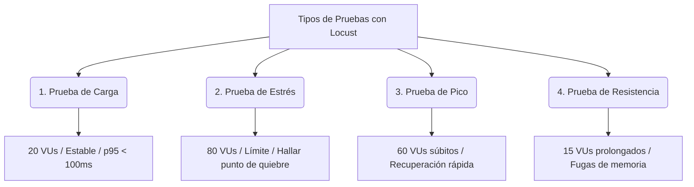

# Plan Detallado de Pruebas de Rendimiento con Locust — MIKITECH

Este documento proporciona una guía paso a paso y la fundamentación metodológica para ejecutar las **4 pruebas de rendimiento clave** en la plataforma **MIKITECH E-Commerce** utilizando **Locust**. 

Las pruebas están diseñadas para evaluar el comportamiento del servidor local bajo diferentes tipos de cargas y perfiles de usuarios.

---

## 📋 1. Requisitos Previos

Antes de iniciar cualquier prueba, asegúrate de cumplir con los siguientes pasos:

### A. Instalar Locust
Asegúrate de que Locust esté instalado en tu entorno virtual de Python. Puedes instalarlo con:
```bash
pip install locust
```

### B. Iniciar el Servidor de Producción Local (Waitress)
**IMPORTANTE:** No utilices `manage.py runserver` para estas pruebas, ya que es monohilo y colapsará rápidamente. Utiliza **Waitress**, que está configurado con 20 hilos concurrentes en tu proyecto:
1. Abre una terminal.
2. Posiciónate en la raíz del proyecto.
3. Ejecuta el servidor:
   ```bash
   $env:PYTHONPATH="servidor-y-logica"; waitress-serve --port=8000 --threads=20 mickytech.wsgi:application
   ```
   *El servidor quedará escuchando en `http://localhost:8000`.*

### C. Conocer el Script de Locust (`locustfile.py`)
El archivo de pruebas se encuentra en [locustfile.py](file:///c:/Users/turca/Desktop/MIKITECH-APP/tests/load/locustfile.py) y simula el siguiente comportamiento de usuario con esperas de 1 a 3 segundos entre tareas:
- **Ping (`/ping/`):** Verificación de estado rápida y liviana (peso: 5).
- **Home (`/`):** Acceso a la página principal de la tienda (peso: 3).
- **Catálogo (`/productos/`):** Exploración de productos tecnológicos (peso: 2).
- **Carrito (`/carrito/`):** Entrada a ver el carrito de compras (peso: 1).

---

## 🚀 2. Las 4 Pruebas de Locust

A continuación se detallan las 4 pruebas que debes presentar y cómo ejecutarlas.



---

### 📈 PRUEBA 1: Prueba de Carga (Load Test)
**Objetivo:** Evaluar el rendimiento del servidor bajo una carga normal y predecible de usuarios concurrentes navegando constantemente.

*   **Usuarios Totales (VUs):** `20`
*   **Tasa de Subida (Spawn Rate):** `2` usuarios por segundo (tarda 10 segundos en alcanzar el total).
*   **Duración Sugerida:** 5 minutos.
*   **Comando de Ejecución Automática (Genera Reporte HTML):**
    ```bash
    locust -f tests/load/locustfile.py --headless -u 20 -r 2 -t 5m --host=http://localhost:8000 --html docs/reporte_carga.html
    ```
*   **Criterios de Aceptación:**
    - Tasa de errores: **0.00%**.
    - Tiempo de respuesta p95: **Menor a 100 ms**.
    - Servidor estable sin caídas ni degradación de velocidad.

---

### 💥 PRUEBA 2: Prueba de Estrés (Stress Test)
**Objetivo:** Forzar la aplicación por encima de su capacidad de diseño habitual para encontrar el punto de quiebre (breaking point) y observar cómo falla el sistema.

*   **Usuarios Totales (VUs):** `80`
*   **Tasa de Subida (Spawn Rate):** `5` usuarios por segundo.
*   **Duración Sugerida:** 5 minutos o hasta que fallen las conexiones.
*   **Comando de Ejecución Automática (Genera Reporte HTML):**
    ```bash
    locust -f tests/load/locustfile.py --headless -u 80 -r 5 -t 5m --host=http://localhost:8000 --html docs/reporte_estres.html
    ```
*   **Criterios de Aceptación / Observaciones:**
    - El punto de quiebre óptimo en desarrollo local suele darse al superar las **30 VUs** simultáneas en solicitudes complejas.
    - Se debe registrar el volumen de usuarios y la tasa de error final (ej: ~10% a 18% con 80 VUs).
    - Verificar que el servidor se recupere por sí mismo una vez finalizada la prueba.

---

### ⚡ PRUEBA 3: Prueba de Pico (Spike Test)
**Objetivo:** Simular una avalancha repentina de tráfico (ej. Black Friday o lanzamiento de producto) para analizar si el sistema se bloquea o si puede amortiguar el impacto y volver a la normalidad al pasar el pico.

*   **Usuarios Totales (VUs):** `60`
*   **Tasa de Subida (Spawn Rate):** `20` usuarios por segundo (alcanza el pico en solo 3 segundos).
*   **Duración Sugerida:** 3 minutos.
*   **Comando de Ejecución Automática (Genera Reporte HTML):**
    ```bash
    locust -f tests/load/locustfile.py --headless -u 60 -r 20 -t 3m --host=http://localhost:8000 --html docs/reporte_pico.html
    ```
*   **Criterios de Aceptación:**
    - Aunque los tiempos de respuesta p95 se elevate momentáneamente durante el pico, no debe haber caídas de base de datos ni cierres del proceso Waitress.
    - El servidor debe estabilizarse y regresar a tiempos óptimos una vez que cese el crecimiento agresivo.

---

### ⏱️ PRUEBA 4: Prueba de Resistencia (Soak / Endurance Test)
**Objetivo:** Mantener una carga moderada y constante durante un tiempo prolongado para identificar problemas acumulativos como fugas de memoria (memory leaks), fugas de conexiones en base de datos (Supabase) o problemas de caché.

*   **Usuarios Totales (VUs):** `15`
*   **Tasa de Subida (Spawn Rate):** `1` usuario por segundo.
*   **Duración Sugerida:** 30 minutos (duración ideal para pruebas locales rápidas; en producción real se corre de 2 a 12 horas).
*   **Comando de Ejecución Automática (Genera Reporte HTML):**
    ```bash
    locust -f tests/load/locustfile.py --headless -u 15 -r 1 -t 30m --host=http://localhost:8000 --html docs/reporte_resistencia.html
    ```
*   **Criterios de Aceptación:**
    - El uso de memoria RAM del proceso Waitress/Python en el Administrador de Tareas debe mantenerse estable (sin crecimiento infinito tipo escalera).
    - Tasa de fallos del **0.00%** al finalizar los 30 minutos.
    - Consistencia en los tiempos de respuesta de principio a fin.

---

## 🛠️ 3. Métodos de Ejecución

Tienes dos maneras de correr estas pruebas en tu máquina Windows. Ambas opciones usan el mismo código de prueba de [locustfile.py](file:///c:/Users/turca/Desktop/MIKITECH-APP/tests/load/locustfile.py).

### Opción A: Modo Interactivo (Interfaz Web - Recomendado para Demostraciones)

1. Abre tu terminal de PowerShell en la raíz del proyecto.
2. Inicia Locust apuntando al archivo:
   ```bash
   locust -f tests/load/locustfile.py
   ```
3. Verás en la consola que el servidor web se inició:
   `[INFO] Starting web interface at http://0.0.0.0:8089`
4. Abre tu navegador favorito y entra a:
   [http://localhost:8089](http://localhost:8089)
5. Rellena los campos con los valores correspondientes al test que deseas hacer:
   - **Number of users**: Ingresa la cantidad de VUs según el test (ej. `20` para Carga, `80` para Estrés).
   - **Spawn rate**: Ingresa el ratio (ej. `2` o `5`).
   - **Host**: `http://localhost:8000`
6. Presiona **Start Swarming**.
7. Monitorea las gráficas y estadísticas en tiempo real. Cuando consideres que recolectaste suficientes datos, presiona **Stop** (esquina superior derecha).

> [!TIP]
> Puedes tomar capturas de pantalla de la pestaña **Charts** de la interfaz web para documentar visualmente el comportamiento de cada prueba en tus informes de calidad.

---

### Opción B: Modo Consola (Headless - Recomendado para Reportes Oficiales)

Este modo ejecuta la prueba en segundo plano por el tiempo exacto configurado y exporta un informe web `.html` interactivo y profesional que puedes abrir con doble clic.

Abre PowerShell en la raíz del proyecto y corre el comando del test que desees:

*   **Para Carga:**
    ```bash
    locust -f tests/load/locustfile.py --headless -u 20 -r 2 -t 5m --host=http://localhost:8000 --html docs/reporte_carga.html
    ```
*   **Para Estrés:**
    ```bash
    locust -f tests/load/locustfile.py --headless -u 80 -r 5 -t 5m --host=http://localhost:8000 --html docs/reporte_estres.html
    ```
*   **Para Pico:**
    ```bash
    locust -f tests/load/locustfile.py --headless -u 60 -r 20 -t 3m --host=http://localhost:8000 --html docs/reporte_pico.html
    ```
*   **Para Resistencia:**
    ```bash
    locust -f tests/load/locustfile.py --headless -u 15 -r 1 -t 30m --host=http://localhost:8000 --html docs/reporte_resistencia.html
    ```

*Nota: El parámetro `-t 5m` significa 5 minutos. También puedes usar `-t 30s` para 30 segundos si deseas hacer una prueba de demostración ultra-rápida.*

---

## 📊 4. Cómo Analizar los Reportes Generados

Al abrir los archivos `.html` autogenerados en tu carpeta `docs/` (como `reporte_carga.html`), encontrarás la siguiente información clave:

1.  **Request Statistics:** Una tabla que desglosa el rendimiento por URL. Si ves errores en `/carrito/` o `/productos/`, es indicativo de un cuello de botella en la base de datos o en la sesión de Supabase.
2.  **RPS (Requests Per Second):** Cuántas solicitudes por segundo fue capaz de responder la app. Con Waitress estable verás una línea horizontal limpia. Con saturación (Estrés) verás que los RPS empiezan a caer o fluctúan mucho.
3.  **Response Times (Percentiles):** El percentil 95 (p95) te indica el peor tiempo de respuesta del 95% de tus usuarios virtuales. Si se eleva por encima de los 500 ms en carga normal, hay que optimizar consultas.
4.  **Failures:** La lista de errores detallados (ej: `ConnectionResetError` o códigos HTTP como 500/504).
